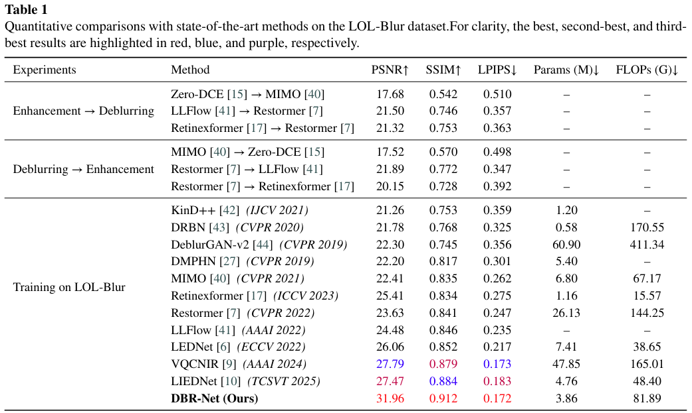

# DBR-Net: 
## Abstract
Images captured in low-light environments often suffer from insufficient illumination and motion blur simultaneously, resulting in degraded visibility, blurred boundaries, and missing texture details. Existing cascaded or unified restoration methods remain limited in recovering coherent structures under such coupled degradations, particularly when illumination-related and blur-related information are entangled in feature representations. In this paper, we propose a compact Degradation-Decoupled Blur Restoration Network (DBR-Net) for joint low-light image enhancement and deblurring. DBR-Net adopts an encoder--decoder architecture that performs degradation-oriented feature modeling. In the encoder, a Fourier Illumination Enhancement Block (FIEB) employs Fourier amplitude similarity-guided modulation to enhance illumination-restoration-related representations. In the decoder, a Wavelet Structure Restoration Block (WSRB) integrates directional wavelet-domain guidance with state space modeling to strengthen the reconstruction of blur-degraded edges and textures. In addition, we introduce a frequency-domain loss to constrain the recovery of degradation-decoupled information and design a progressive two-stage training strategy that first establishes stable illumination and structural restoration capabilities and then refines the final output. Extensive experiments demonstrate the effectiveness of DBR-Net. On the synthetic LOL-Blur dataset, our method achieves 31.96\,dB PSNR, 0.912 SSIM, and 0.172 LPIPS, outperforming existing comparison methods across all three metrics. Without additional fine-tuning, DBR-Net also exhibits competitive generalization on the Real-LOL-Blur dataset and performs favorably on standard low-light enhancement benchmarks. With only 3.86M parameters, DBR-Net provides an effective and parameter-efficient solution for restoring low-light blurry images.
The code is available at \url{https://github.com/ZehuaChenLab/DBR-Net}.

## Quantitative comparisons results on the LOL-Blur dataset.

## Qualitative comparison results on the LOL-Blur dataset.

### The code will be released soon
